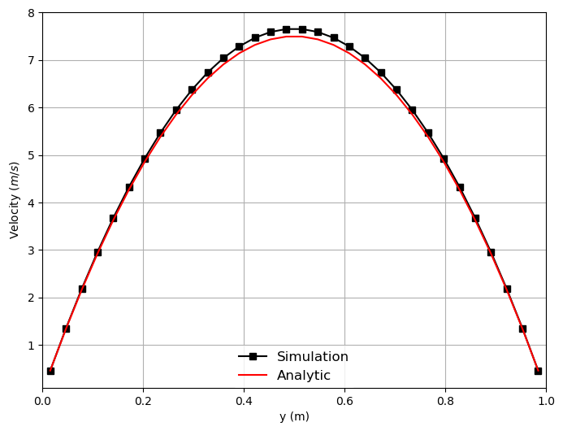
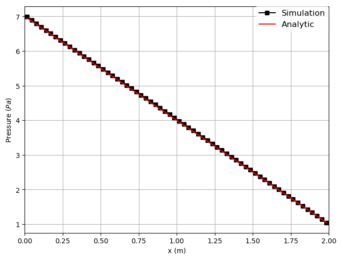

title: Poisueille flow in a channel 2D

Navigate: [&larr; Test case channel 2D](../../index.html)

# Poisueille flow in a channel 2D using drtBGK collision scheme # {#eg_C2D_Simple_drtBGK}

In this example, we will investigate the Poiseuille flow in a plain 2D channel
using the dual relaxation time bgk (drtBGK) collision scheme with a second order
regularization.

This collision scheme is called as below in the identify table.
relaxation = 'drt_bgk'

The fluid table in musubi.lua should include the following
--! [Fluid]
fluid = {
  kinematic_viscosity = nu_phy,
  drt_taun = 0.55 -- default = 0.70
}
--! [Fluid]

The taun has a default value of 0.70 which can be overwritten from input. This
represents a relaxation time, therefore must be greater than 0.50 for stability.
If the value inserted does not produce a stable result, please decrease it
towards 0.50. For this test case with the original seeder.lua file, the default
value of 0.70 does not produce a stable run.

A detailed description of test case can be found in the parent directory
[Description of test case channel 2D](../index.html).

## Generating mesh ##
### Define geometry information ###
### Define spatial objects ###

## Running simulation ##
### Define flow parametes ###
### Define collision parameter ###
### Define boundary condition ###
## Post-processing ##

Here are the results from the simulation. To create them, double the number of
elements in height (nHeight=32) in seeder.lua.

Velocity along the height of the channel:

Pressure across the length of the channel:

Wall shear stress along the height of the channel:

To create these plots, run <tt>python plot_track.py<tt> to create the plots.
Before running the plot script, open 'plot_track.py' and update path to
Gleaner script in 'glrPath'.
Download Gleaner script using
<tt>hg clone https://geb.sts.nt.uni-siegen.de/hg/gleaner</tt>
