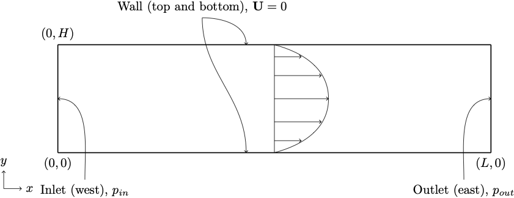

title: Poisueille flow in a channel 2D

Navigate: [&larr; Test case channel 2D](../index.html)
| [Test case channel 2D boundary condition &rarr;](../C2D_BoundaryConditions/index.html)

# Poisueille flow in a channel 2D using different bgk collision schemes# {#eg_C2D_Simple}

In this example, we will investigate the Poiseuille flow in a plain 2D channel.
The objectives of this example is to introduce how to:

* Create a mesh with boundaries using Seeder.
* Post-process the mesh using Seeder-harvester and visualize it Paraview.
* Simulate Poiseuille flow in the channel using Musubi.
* Use different bgk collision schemes (see 'Recommendations' below).
* Validate the numerical results.
* Visualize the flow in Paraview.
* Create a 2D plot using Gleaner tool. Gleaner is a Python tool which
extracts data from Musubi ascii output and uses matplotlib in python library
to create a plot.

Here is the list of test cases to learn these features in Musbi and some hints
on when to use what:
ToDo: Update points/characteristics below.

* [Bhatnagar-Gross-Krook (BGK)](C2D_simple_BGK/index.html)
  * Simplest BGK scheme
* [Regularized BGK (rBGK)](C2D_simple_rBGK/index.html)
  * Non-dissipative scheme.
  * In general more unstable than the classical BGK scheme.
  * Said to exhibit increased stability for problems with large gradients and
    turbulent flows.
* [Recursive regularized BGK (rrBGK)](C2D_simple_rrBGK/index.html)
  * Enhanced stability and accuracy compared to the classical BGK scheme.
  * Said to be cheaper then the classical one.
* [Projected recursive regularized BGK (prrBGK)](C2D_simple_prrBGK/index.html)
  * ToDo: Add information here.
* [Hybrid recursive regularized BGK (prrBGK)](C2D_simple_hrrBGK/index.html)
  * ToDo: Add information here.
* [Dual relaxation time BGK (drtBGK)](C2D_simple_drtBGK/index.html)
  * ToDo: Add information here.

## Problem description ##

The Poiseuille flow is the fully developed laminar flow between two parallel
plates induced by a constant pressure drop in a channel of length L.
In general, the flow can be induced by any of the following way:

* Defining pressure at inlet and outlet of the channel.
* Defining velocity at inlet and pressure at outlet of the channel.
  [Here](../C2D_BoundaryConditions/BC_VeNonEqExpol_PressNonEqExpol/index.html)
  is the example.
* Using pressure gradient i.e. pressure drop/length as a external force.
  [Here](../C2D_Force/index.html) is the example.

Here, the flow is induced by pressure boundary condition at inlet (west)
and outlet (east) boundaries as shown in figure below.

The pressure drop along the channel per unit length is
\begin{equation}
  \frac{\nabla p}{L} = \frac{p_{inlet} - p_{outlet}}{L}
  = \frac{8 \mathbf{U}_m \rho\nu}{H^2}
\end{equation}
where,

* \( \mathbf{U}_m \) - the maximum fluid velocity at the channel center axis,
* \( \rho=1.0 \) - the fluid density and
* \( \nu=10^{-3} m^2/s \) - kinematic viscosity.

The Reynolds number is defined as
\begin{equation}
  Re=\frac{\mathbf{\bar U} H}{\nu}
\end{equation}
where, \( \bar{U} \) - the mean velocity.
For the parabolic velocity profile, the mean velocity can be computed with
\( \mathbf{\bar U} = 2 \mathbf{U}_m /3 \).

The analytical velocity profile along channel height is given as
\begin{equation}
  \mathbf{U}(x,y) = \frac{4 \mathbf{U}_m y (H-y)}{H^2},
\end{equation}
the analytical pressure profile along the channel length is
\begin{equation}
  p(x,y) = p_0 + \nabla p (L-x)
\end{equation}
and wall shear stress profile along the channel height is
\begin{equation}
  \sigma = \frac{2 \nu |y-H/2| \mathbf{U}_m}{(H/2)^2}.
\end{equation}
The error between analytical solution (\( u_a \)) and simulated results
(\( u_s \)) are defined by the \( L^2 \) relative error norm as
\begin{equation}
  L^2\ relative\ error\ norm =
   \sqrt {\frac{\sum_i (u_a(i) - u_s(i) )^2}{\sum_i u_a(i)^2}}.
\end{equation}

## Generating mesh ##
### Define geometry information ###
### Define spatial objects ###

## Running simulation ##
### Define flow parametes ###
### Define boundary condition ###

## Post-processing ##

Here are the results from the simulation.

Velocity along the height of the channel:

Pressure across the length of the channel:

Wall shear stress along the height of the channel:

To create these plots, run <tt>python plot_track.py<tt> to create the plots.
Before running the plot script, open 'plot_track.py' and update path to
Gleaner script in 'glrPath'.
Download Gleaner script using
<tt>hg clone https://geb.inf.tu-dresden.de/hg/gleaner</tt>
