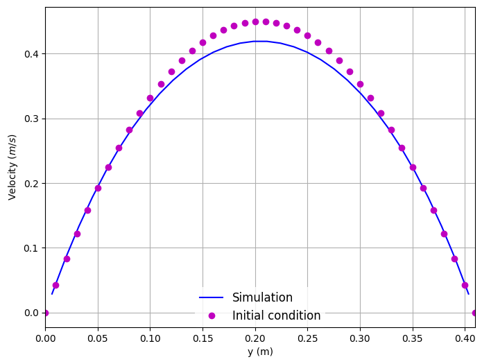

title: Simple Flow in a 3D Channel
@warning WORK IN PROGRESS @endwarning

Navigate: [&larr; Test Case Channel 3D](../index.html)

# Simple Flow in a Channel 3D # {#eg_C3D_Simple}

@Note
Note that we reduced the pysical simulation time of the case for our
recheck. Therefore, 'useRecheck' is set to true in 'musubi.lua'. To reproduce
the results presented in the following, you have to deactivate this option in
'musubi.lua':

```lua
useRecheck = false
```

The tracking output of the fully converged reference is found in
`reference/converged`.
@endnote

In this example, we will investigate the flow in a simple 3D channel.
The objectives of this example are to introduce how to:

* Create a mesh with boundaries using Seeder.
* Post-process the mesh using `sdr_harvester` and visualize it with Paraview.
* Simulate the flow in the channel using Musubi.
* Validate the numerical results.
* Visualize the simulation results in Paraview.
* Create a 2D plot using the Gleaner tool. Gleaner is a Python tool which
  extracts data from Musubi ascii output and uses matplotlib in python library
  to create a plot.

### Problem Description ###

The test case is based on the well-known paper:
Schäfer, M. et al. (1996) ‘Benchmark Computations of Laminar Flow Around a
Cylinder’, in Hirschel, E. H. (ed.) Flow Simulation with High-Performance
Computers II: DFG Priority Research Programme Results 1993--1995. Wiesbaden:
Vieweg+Teubner Verlag, pp. 547–566. doi: 10.1007/978-3-322-89849-4_39.

As we want to increase the complexity step by step, we start with the channel,
but without the cylinder in it. The geometry configurations and the boundary
conditions are depicted in the figure below.


The channel has a squared cross-section, where height and width are H = 0.41m.
The length of the channel is L = 2.5m.

The fluid can be described as incompressible Newtonian fluid, with a
kinematic viscosity of \( \nu = 10^{−3} m^2/s \), where the fluid density is
\( \rho = 1.0 kg/m^3 \).

@Note
In the simulation the viscosity is derived from the Re, to use a Mach number
that allows for a faster computation of the problem.
@endnote

The Reynolds number is defined as
\begin{equation}
  Re=\frac{\mathbf{\bar U} H}{\nu}
\end{equation}
where, \( \bar{U} \) - the mean velocity.
The mean velocity can be computed with
\( \mathbf{\bar U} = 4 \mathbf{U}_{m} /9 \)
where, \( \mathbf{U}_{m} \) - the maximum fluid velocity at the channel center
axis.

The flow is induced by defining velocity at inlet and pressure at outlet of the
channel. At the inlet (green in the figure above), a parabolic velocity inflow
condition in x-direction is used:
\begin{equation}
  U_x(0,y,z) = \frac{16 \mathbf{U}_m yz (H-y)(H-z)}{H^4}, U_y = U_z = 0
\end{equation}
with \( U_m = 0.45 \text{m/s} \) resulting in a mean velocity of
\( \bar{U} = 0.2 \text{m/s} \) and a Reynolds number (\ Re = 20 \).
At the outlet (red in the figure above), the ambient pressure is prescribed with
(\ p=0.0 \) . For all the other boundaries (north, south, top and bottom), wall
boundary conditions are used.

For a better overview of the parameters used, one can use the `printParams.lua`.
By running it with 'lua printParams.lua' one gets the following information:

```
-----------------------------------------------------------------------
Simulation name:        C3D_Simple
-----------------------------------------------------------------------
------Mesh parameters------
height       =  0.41
width        =  0.41
length       =  2.5
in length    =  196
length_bnd   =  3.28
level        =  8
-----Number of elements----
in height    =  32
in width     =  32
in length    =  196
--------Resolution---------
spatial    =    0.0128125
temporal   =    2.156647324779e-05
-----------------------------------------------------------------------
------Flow parameters------
------In physical units----
Re                =     20
Vel. mean         =     15.244444444444 [m/s]
Vel. max.         =     34.3 [m/s]
Kinematic visc.   =     0.31251111111111 [m^s/2]
Density           =     1 [kg/m^3]
Press. ambient    =     117649 [N/m^2]
Element size (dx) =     0.0128125 [m]
Time step (dt)    =     2.156647324779e-05 [s]
------In lattice units-----
Vel.              =       0.057735026918963
Ma                =       0.1
Kinematic lattice visc. = 0.041056019142373
Relaxation param. =       1.6047035596284
-----------------------------------------------------------------------
```

## Post-Processing ##

Here are the results from the simulation.

Velocity along the height of the channel:


Pressure across the length of the channel:


To create these plots, run <tt>python plot_track.py<tt> to create the plots.
Before running the plot script, open 'plot_track.py' and update path to
Gleaner script in 'glrPath'.
Download Gleaner script using
<tt>hg clone https://geb.inf.tu-dresden.de/hg/gleaner</tt>.
