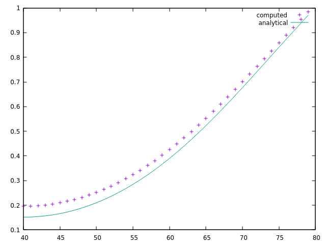

title: Diffusion from cylinder without flow
@warning WORK IN PROGRESS @endwarning

# Diffusion from cylinder without flow # {#eg_GPP}

In this example, we will investigate a system consisting of a cylindrical
cavity of radius a filled with a stationary liquid.
The control equation is
$$
      \frac{\partial}{\partial t} C(r, t) = D \frac{1}{r} \frac{\partial}{\partial r}
       r \frac{\partial}{\partial r} C(r, t)
$$

  with the initial and boundary condition $ C(r < a, t = 0) = C_0 $,
  $ C(r = a, t) = C_c $. The analytical solution is
$$
      \frac{C(r, t)-C_c}{C_0-C_c} = \sum_{n=1}^{\inf} \frac{2}{\mu_n J_1(\mu_n)}
      exp(-\mu_n^2 \frac{Dt}{a^2}) J_0(\mu_n \frac{r}{a})
$$

  $ J_0(x) $ and $ J_1(x) $ are 0th and 1st order Bessel functions. $ \mu_n $ is the
  n-th root of $ J_0(x) $. The first 5 roots are 2.2048, 5.5201, 8.6537, 11.7915,
  14.9309 respectively. By taking initial value $ C_0 = 0 $, the analytical solution becomes
$$
      C(r, t) = C_c (1 - \sum_{n=1}^{\inf} \frac{2}{\mu_n J_1(\mu_n)}
      exp(-\mu_n^2 \frac{Dt}{a^2}) J_0(\mu_n \frac{r}{a}))
$$

In our simulation, the cylinder diameter $a=40$ is used as a default value. The D2Q9 layout is used.
The pressure anti-bounce back boundary condition is used to compute and compare with the
analytical solutions.

Simply executing <tt>run.sh<tt> to get the above figure. Please try to use different initial condition
by setting different values of $ tIni $ in <tt>musubi.lua<tt>. Test how the initial condition impacts
the result.

The objectives of this example is to introduce how to:
* Simulate time evolution of the diffusion process inside a 2D cylinder
* Testify the correctness of the anti-bounce back Dirichlet boundary condition
* Examine the solver stability with different initial conditions and collision schemes

